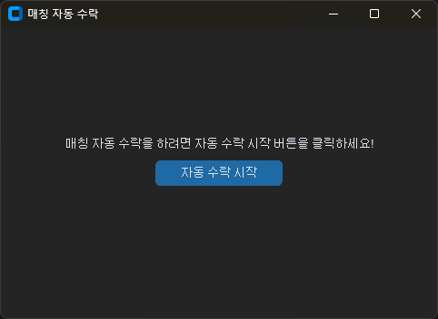

# <div align="center">LOL Auto Accept</div>

롤 대전 찾기를 시작하고 스트레칭 하고 싶을 때, 핸드폰을 하고 싶을 때, 화장실 가고 싶을 때 등

잠깐 다른 일을 봐야 할 떄 자동으로 수락을 눌러주는 프로그램 입니다.

[다운로드 링크](https://github.com/hyanghoa/lol_auto_accept/releases)

<br>

## <div align="center">실행 화면</div>

<div align="center">
    
</div>

<br>

## <div align="center">설치 방법</div>

### 가상환경 (env)

개발을 위한 가상환경 설치

```bash
pip install -r requirements.txt
```

### 실행 파일 만들기

pyinstaller를 사용한 exe 실행 파일을 만드려면 아래 명령어를 입력

```bash
pyinstaller --onefile --noconsole --add-data accept_button.png:. --name lol_auto_accept tk.py
```